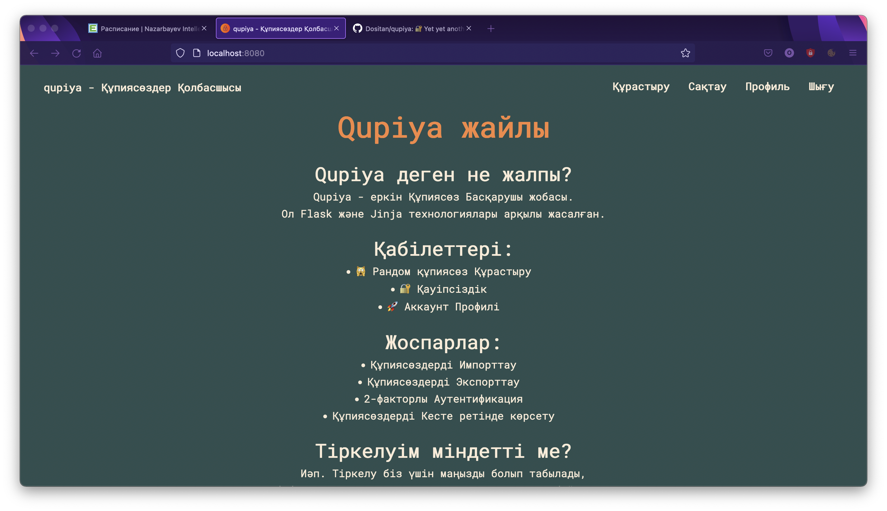

    <h1>Qupiya</h1>
    
~ A simple password-managing website.

     
    <strong>how do you pronounce it tho?</strong>
    
- It's "qūpia", which means "secret" in Kazakh

### Why to use?
**IDK.** Qupiya is just another password manager among many, `but it's open source.`

---

### Run locally
**NOTE**: I assume that you have PostgreSQL set and running.

Clone the repository:

    $ git clone https://github.com/Dositan/qupiya.git

CD into the directory, spawn virtual environment and install dependencies:

    $ cd qupiya
    $ poetry shell
    $ poetry install

Setting configuration:
1. Open [.dist.env](/.dist.env) file;
2. Update for your own purposes;
3. Rename to `.env` after setting things up.

Run app with:

    $ flask run
